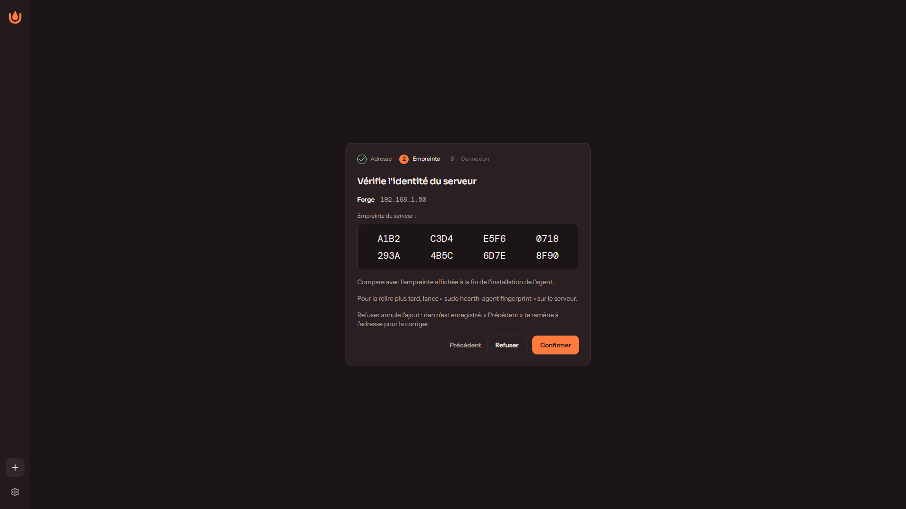
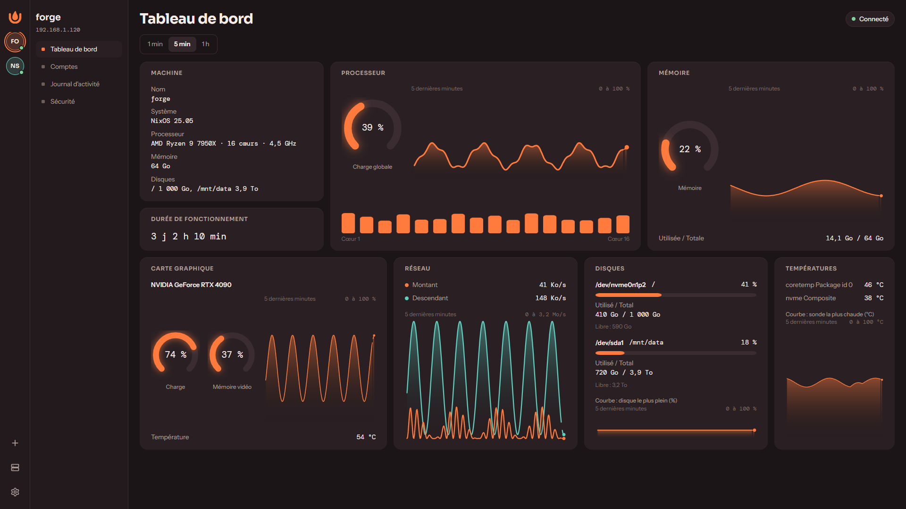
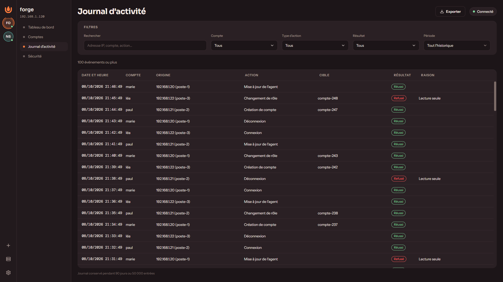
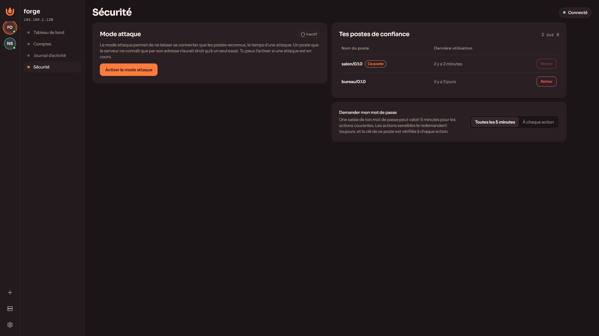

<p align="center">
  
</p>

<h1 align="center">Hearth</h1>

<p align="center">
  Surveille et pilote ton serveur maison depuis ton PC Windows.<br>
  Pour toi qui as un serveur Linux chez toi et qui veux le voir d'un coup d'œil, sans service tiers.
</p>

> **État : version 0.1.0 en préparation. Aucune version n'est encore publiée.**
> Le socle est écrit et testé. Les versions seront servies depuis un site du propriétaire du projet, à l'adresse `<ADRESSE-DES-VERSIONS>` (pas encore fixée), et non depuis les « Releases » de GitHub. Tant qu'elle n'existe pas, tu peux construire Hearth toi-même (voir plus bas).

## Aperçu

Les captures viennent de l'application branchée sur un serveur simulé : les noms, adresses et chiffres sont inventés.

| | |
|---|---|
|  |  |
| Ajouter un serveur : tu vérifies son empreinte. | Le tableau de bord : processeur, mémoire, disques, réseau, températures. |
|  |  |
| Le journal d'activité : qui a fait quoi, depuis où. | La page Sécurité : postes de confiance et mode attaque. |

## Ce que Hearth fait aujourd'hui

- **Connexion à un serveur par son empreinte.** Tu ajoutes ton serveur par son adresse et tu vérifies son identité une fois pour toutes.
- **Comptes et rôles.** Un compte « Administrateur » peut tout faire. Un compte « Lecture seule » regarde sans rien changer. Les administrateurs créent, modifient et suppriment les comptes depuis l'application.
- **Tableau de bord de la machine.** Processeur (global et par cœur), mémoire, disques, carte graphique, réseau, températures, durée de fonctionnement, avec des courbes sur 1 minute, 5 minutes ou 1 heure.
- **Journal d'activité.** Connexions, refus, gestion des comptes, mises à jour. Recherche, filtres, export. Conservé 90 jours ou 50 000 entrées.
- **Sécurité.** Postes de confiance (chaque PC enregistré est reconnu par une clé), alerte quand un compte semble visé par des essais de mot de passe, mode attaque qui n'accepte plus que les postes reconnus.
- **Mises à jour signées**, pour le client et pour l'agent : rien ne s'installe si la signature est mauvaise.
- **Reconnexion automatique** si le serveur redémarre ou si le réseau coupe, et un état clair « Connecté », « Reconnexion… », « Hors ligne ».
- **Démarrage avec Windows** (réglable) et notifications Windows.

## Ce qui viendra

Le but de Hearth est d'aller plus loin que la surveillance : services compartimentés (jeux, applications, modèles d'IA), alimentation et réveil par le réseau, éclairage, écran du boîtier. **Rien de cela n'existe encore** et il n'y a pas de date. Le client existe pour Windows seulement, et l'agent pour Linux x86_64 seulement (le type de processeur de la plupart des PC et serveurs ; arm64 n'est pas pris en charge pour l'instant).

## Comment ça marche

```
   ton PC Windows                              ton serveur Linux
  +-----------------+     ton réseau local     +------------------+
  |  Hearth         |  <------------------->   |  agent Hearth    |
  |  (le client)    |    connexion chiffrée,   |  (un service)    |
  +-----------------+    port 7341 par défaut  +------------------+
```

- L'**agent** est un petit programme installé sur ton serveur. Il mesure la machine et garde les comptes et le journal.
- Le **client** est l'application Windows. Il se connecte à l'agent et affiche ce qu'il reçoit.
- Les deux se parlent **sur ton réseau local**, en connexion chiffrée. La surveillance ne passe par aucun serveur extérieur ni par aucun compte en ligne.

## Sécurité, en clair

- **L'empreinte.** À l'installation, l'agent fabrique un certificat et en tire une empreinte (huit groupes de quatre caractères). À la première connexion, le client te la montre : tu la compares avec celle de l'installation. Si elle change plus tard, la connexion est suspendue jusqu'à ce que tu décides. C'est ce qui t'empêche de te connecter à un faux serveur.
- **Les comptes.** Les mots de passe sont conservés sous forme hachée (Argon2id) sur le serveur. Sur ton PC, un mot de passe mémorisé va dans le Gestionnaire d'identification de Windows, jamais dans un fichier. Trop d'essais ratés ralentissent les suivants.
- **Les postes de confiance.** Chaque PC reçoit une clé. Les actes d'administration demandent ton mot de passe et la preuve de cette clé.
- **Les mises à jour signées.** Le client et l'agent vérifient une signature avant d'installer quoi que ce soit. L'agent revient seul à la version précédente si la nouvelle ne répond pas.
- **Pas de télémétrie.** Le code ne contient aucun envoi de statistiques ni de rapport de plantage. La seule sortie vers Internet du client est la recherche de nouvelle version (au lancement, puis une fois par jour au plus). Aujourd'hui l'adresse interrogée dans le code est celle des « Releases » du dépôt GitHub ; elle est appelée à pointer vers `<ADRESSE-DES-VERSIONS>`.
- **Une réserve honnête.** Le programme d'installation du client n'est pas encore signé par un certificat Windows : voir le [tutoriel](docs/guides/installer-hearth-pas-a-pas.md).

## Installer

Il faut un PC Windows et un serveur Linux x86_64 sur le même réseau. Version courte :

1. Sur le serveur, installe l'agent : `sudo sh install.sh` (le script sera téléchargeable à `<ADRESSE-DES-VERSIONS>`) ; note l'empreinte affichée.
2. Sur Windows, lance l'installateur `Hearth_<version>_x64-setup.exe` (à `<ADRESSE-DES-VERSIONS>`).
3. Dans Hearth, clique sur « Ajouter un serveur », compare l'empreinte, connecte-toi.

Le guide complet, pour quelqu'un qui n'a jamais ouvert un terminal : [Installer Hearth pas à pas](docs/guides/installer-hearth-pas-a-pas.md). Pour les administrateurs : [`docs/runbooks/installer-agent.md`](docs/runbooks/installer-agent.md) (installation sans question, NixOS et systèmes sans systemd, désinstallation, dépannage).

## Construire depuis les sources

Prérequis : Rust 1.95 (installé tout seul par `rust-toolchain.toml`), Node.js et npm pour l'interface, Docker pour construire l'agent statique.

**L'agent** (binaire Linux statique, construit dans un conteneur) :

```sh
cargo xtask agent                                   # produit target/dist/hearth-agent
sudo sh deploy/install.sh --binary ./hearth-agent   # puis l'installe sur le serveur
```

**Le client Windows** :

```sh
cd apps/desktop
npm ci
npm run tauri build     # installateur dans target/release/bundle/nsis/
```

**Les vérifications** (celles de la CI) :

```sh
cargo fmt --all
cargo clippy --workspace --all-targets -- -D warnings
cargo test --workspace
```

Sur un clone neuf sous Windows, construis d'abord l'interface une fois (`cd apps/desktop && npm ci && npm run build`) : la coque Tauri la lit à la compilation. Sous Linux, ajoute `--exclude hearth-desktop` aux commandes `--workspace`. Détails dans [`CLAUDE.md`](CLAUDE.md).

## Documentation

- [`ARCHITECTURE.md`](ARCHITECTURE.md) : la carte du code.
- [`docs/INDEX.md`](docs/INDEX.md) : décisions (ADR), règles métier, contrats de l'API, composants, bugs corrigés, procédures (runbooks) et guides.

## Contribuer

Les contributions externes ne sont pas acceptées pour l'instant. Tu peux en revanche ouvrir une « issue » sur GitHub pour signaler un problème ou poser une question.

## Licence

Hearth est distribué sous licence [GNU AGPL version 3 ou ultérieure](LICENSE) : tu peux l'utiliser, le modifier et le redistribuer, y compris commercialement, à condition de publier tes modifications sous la même licence, même si tu ne fais que le faire tourner comme service.

Copyright © 2026 Voikyrioh. Pour un usage hors des conditions de l'AGPL, une licence commerciale peut être accordée par l'auteur.
